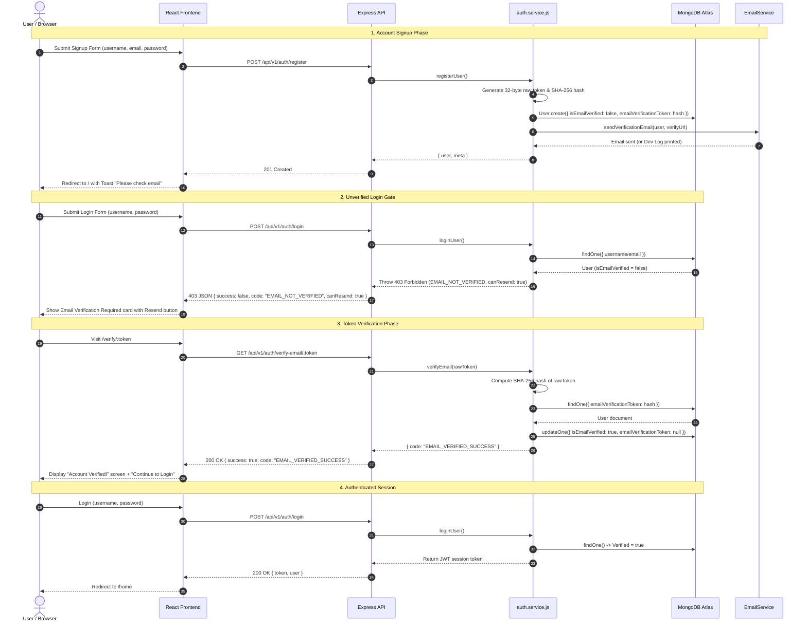

# FutureMedia Authentication & Verification Flow

## End-to-End Sequence Diagram

```mermaid
sequenceDiagram
    autonumber
    actor User as User / Browser
    participant React as React Frontend
    participant API as Express API
    participant Auth as auth.service.js
    participant DB as MongoDB Atlas
    participant Email as EmailService

    %% Signup Phase
    Note over User, Email: 1. Account Signup Phase
    User->>React: Submit Signup Form (username, email, password)
    React->>API: POST /api/v1/auth/register
    API->>Auth: registerUser()
    Auth->>Auth: Generate 32-byte raw token & SHA-256 hash
    Auth->>DB: User.create({ isEmailVerified: false, emailVerificationToken: hash })
    Auth->>Email: sendVerificationEmail(user, verifyUrl)
    Email-->>Auth: Email sent (or Dev Log printed)
    Auth-->>API: { user, meta }
    API-->>React: 201 Created
    React-->>User: Redirect to / with Toast "Please check email"

    %% Unverified Login Attempt
    Note over User, DB: 2. Unverified Login Gate
    User->>React: Submit Login Form (username, password)
    React->>API: POST /api/v1/auth/login
    API->>Auth: loginUser()
    Auth->>DB: findOne({ username/email })
    DB-->>Auth: User (isEmailVerified = false)
    Auth-->>API: Throw 403 Forbidden (EMAIL_NOT_VERIFIED, canResend: true)
    API-->>React: 403 JSON { success: false, code: "EMAIL_NOT_VERIFIED", canResend: true }
    React-->>User: Show Email Verification Required card with Resend button

    %% Verification Phase
    Note over User, DB: 3. Token Verification Phase
    User->>React: Visit /verify/:token
    React->>API: GET /api/v1/auth/verify-email/:token
    API->>Auth: verifyEmail(rawToken)
    Auth->>Auth: Compute SHA-256 hash of rawToken
    Auth->>DB: findOne({ emailVerificationToken: hash })
    DB-->>Auth: User document
    Auth->>DB: updateOne({ isEmailVerified: true, emailVerificationToken: null })
    Auth-->>API: { code: "EMAIL_VERIFIED_SUCCESS" }
    API-->>React: 200 OK { success: true, code: "EMAIL_VERIFIED_SUCCESS" }
    React-->>User: Display "Account Verified!" screen + "Continue to Login"

    %% Post-Verification Login
    Note over User, DB: 4. Authenticated Session
    User->>React: Login (username, password)
    React->>API: POST /api/v1/auth/login
    API->>Auth: loginUser()
    Auth->>DB: findOne() -> Verified = true
    Auth-->>API: Return JWT session token
    API-->>React: 200 OK { token, user }
    React-->>User: Redirect to /home
```
