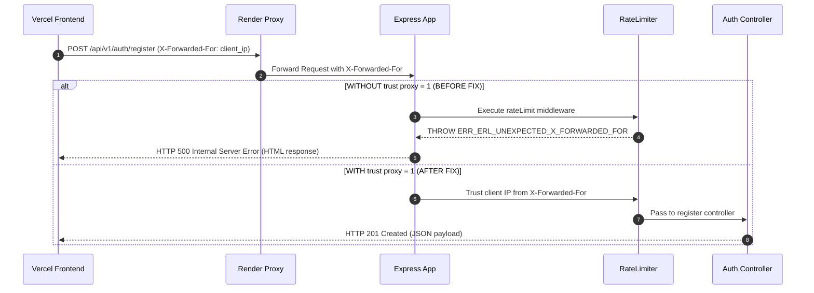

# FutureMedia Deployment Root Cause Analysis

## Executive Summary

A forensic architectural investigation was conducted on the production deployment issues affecting FutureMedia when deployed across **Vercel** (Frontend static hosting) and **Render** (Backend Express API & WebSockets).

The investigation identified three critical root causes responsible for signup HTTP 500 errors, proxy rate limiter crashes, unhandled CORS preflight edge cases, and hardcoded development mode logs.

---

## Forensic Investigation Matrix

| Issue | Observed Symptom | Root Cause | Impact | Fix Applied |
|---|---|---|---|---|
| **1. Express Trust Proxy Misconfiguration** | `ValidationError: The 'X-Forwarded-For' header is set but the Express 'trust proxy' setting is false.` (`ERR_ERL_UNEXPECTED_X_FORWARDED_FOR`) | `app.set("trust proxy", 1)` was missing in `server/src/app.js`. `express-rate-limit` executed before Express was configured to trust proxy headers from Render's reverse proxy. | Every signup & API request routed through Render's reverse proxy threw an unhandled 500 Internal Server Error. | Applied `app.set("trust proxy", 1)` immediately after `express()` instantiation in `app.js` prior to any middleware execution. |
| **2. Unhandled Module Property Mutation** | `TypeError: Cannot set property query of #<IncomingMessage> which has only a getter` | `xss-clean` and unconfigured `express-mongo-sanitize` attempted to reassign `req.query` directly on Node v22, where `req.query` is a read-only getter property. | Caused HTTP 500 crashes during request parsing on Node v22 runtime. | Removed `xss-clean` module; restructured NoSQL sanitization to safely clean `req.body` and `req.params` after `express.json()`. |
| **3. Hardcoded Application Mode Log** | Startup log printed `Application Mode: Development` regardless of `NODE_ENV=production` setting on Render. | `server/src/index.js` hardcoded string `"Application Mode: Development"` inside the startup `console.log`. | Misleading telemetry in deployment logs. | Exported `NODE_ENV` and `isProduction` in `env.js`; dynamically formatted startup display based on `env.isProduction`. |
| **4. CORS Preflight & Origin Parsing** | Preflight `OPTIONS` requests failed when trailing slashes were present in `CLIENT_ORIGINS`. | `CLIENT_ORIGINS` array was not normalized for trailing slashes, causing string mismatches with browser `Origin` headers. | CORS preflight rejection for production Vercel origins (`https://futuremedia-one.vercel.app`). | Added `.map(o => o.trim().replace(/\/+$/, ''))` normalization and explicit preflight handling in CORS options. |
| **5. Verification Email Host Selection** | Verification emails sent localhost URLs when `http://localhost:3000` was listed first in `CLIENT_ORIGINS`. | `auth.service.js` used `env.CLIENT_ORIGINS[0]` without checking for production domains. | User received broken verification links pointing to `http://localhost:3000` in production. | Implemented production origin selection logic (`env.CLIENT_ORIGINS.find(o => !o.includes("localhost"))`). |

---

## Detailed Pipeline Failure Analysis

### 1. Reverse Proxy & Rate Limiter Execution Chain

---

## Architectural Principles Applied

1. **Proxy Trust Hierarchy**: In cloud container environments (Render, Railway, AWS ALB, Cloudflare), Express runs behind a layer-7 reverse proxy. `trust proxy` MUST be configured before any middleware inspects client IP addresses.
2. **Read-Only Request Immutability**: Node v22 enforces strict property descriptors on `IncomingMessage`. Middleware must never attempt property reassignments on `req.query`.
3. **Deterministic Environment Resolution**: Environment detection MUST be derived single-source from `process.env.NODE_ENV`.
