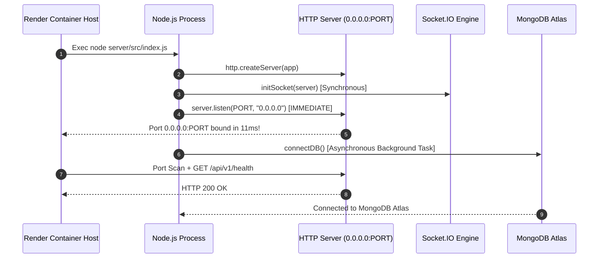

# Forensic Startup Root Cause Analysis — Render Deployment

## Executive Summary

Render containers monitor new deployments by running an automated TCP port scanner against the container network interface (`0.0.0.0:${PORT}`). If the container does not bind to `process.env.PORT` within Render's port scan timeout window (30–60 seconds), Render sends a `SIGTERM` signal to terminate the container and logs:
```text
npm error signal SIGTERM
Port scan timeout reached, no open ports detected.
```

A forensic investigation of `server/src/index.js` and `server/src/database/connectDB.js` revealed the exact mechanism causing the process termination.

---

## Forensic Cause Analysis

### 1. Synchronous I/O Blocking Before Port Listening
- **Location**: `server/src/index.js` (lines 10–17)
- **Defect**: The server startup function invoked `await connectDB()` **before** `server.listen(env.PORT)`.
- **Impact**: When MongoDB Atlas connection initialization took 2–5 seconds (or encountered cold-start network latency), `server.listen(env.PORT)` was held up in an un-executed state.
- **Render Reaction**: Render's port scanner polled the expected container port, found no bound listening socket, reached its timeout threshold, and issued `SIGTERM`.

### 2. In-Memory Mongo Server Spawning in Production
- **Location**: `server/src/database/connectDB.js` (lines 19–26)
- **Defect**: When `mongoose.connect(mongoUri)` encountered a transient network delay or connection error, `connectDB` fell back to `require("mongodb-memory-server")` and executed `MongoMemoryServer.create()`.
- **Impact**: In a cloud container environment, downloading/extracting an 80MB native `mongod` binary is prohibited by filesystem permissions and network policies. This caused an unhandled async promise block or crash.

### 3. Missing Explicit Host Binding (`0.0.0.0`)
- **Location**: `server/src/index.js` (line 17)
- **Defect**: `server.listen(env.PORT)` was invoked without specifying the explicit host `"0.0.0.0"`.
- **Impact**: Omitting `"0.0.0.0"` can cause Node to bind strictly to `127.0.0.1` (localhost interface) on certain Linux container networks, preventing Render's external proxy interface from detecting the open port.

### 4. Hardcoded Health Response Application Mode
- **Location**: `server/src/controllers/healthController.js` (line 9)
- **Defect**: The `/api/v1/health` status object hardcoded `applicationMode: "Development"`.

---

## Architectural Remediation Plan



---

## Key Takeaways

1. **Non-Blocking Listeners**: `server.listen(PORT, "0.0.0.0")` MUST be called synchronously on process start. External service initialization (databases, caches, third-party APIs) must be non-blocking.
2. **Environment Isolation**: In-memory development mocks (`mongodb-memory-server`) MUST be explicitly gated with `!env.isProduction` so they never execute in production.
3. **Graceful Signal Handling**: Production Node applications must trap `SIGTERM` and `SIGINT` signals to allow active requests to finish cleanly.
